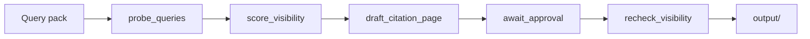

# Site Pulse Audit — Hackathon Demo

Public stripped demo for the [Agents for Humans](https://agentsforhumans.devpost.com/) hackathon.

**Site Pulse Audit** (`sitepulseaudit.com`) helps solopreneur products get **named in LLM-style answers** (ChatGPT / Claude / Grok / Perplexity), not only Google ads.

Agent: **LLMCite** (Strands Agents SDK). Dogfood product: [SleepFix](https://sleepcoach.longevitygreenlight.com/sleepfix.html).

> Private product codebase (PayFast, DynamoDB unlock, production Lambda) lives in a separate private repo. This public repo has **no payment code, no AWS credentials, and no live Function URL**.

## Solution loop

1. **Probe** — ask real buying questions  
2. **Score** — named / ignored / competitor  
3. **Draft** — citation-ready page built to be quoted  
4. **Approve** — human gate (never auto-publish)  
5. **Re-check** — run again and diff



## Quick start (offline demo — no Bedrock required)

```bash
./demo.sh
```

Or manually:

```bash
python3 -m venv .venv
source .venv/bin/activate
pip install -r requirements.txt

# Offline demo (fixtures / mocked answers) — full loop
python agent.py --mode pipeline --auto-approve

# Interactive approval
python agent.py --mode pipeline

# Strands Agent mode (needs configured model / AWS Bedrock access)
python agent.py --mode agent
```

If Bedrock / AWS is unavailable, keep using `--mode pipeline`: it loads `fixtures/probe_responses.json` and still produces a full report.

Outputs land in `output/`:

- `probe.json`, `score_report.md` / `.json`, `citation_draft.md`
- `approval.json`, `recheck_diff.json`
- `report.html` — open for the product-style score UI

Sample UI / report:

- Landing (static demo UI): open `web/index.html` in a browser  
- Sample report: `web/sample-report.html` or `web/report-draft-11point.html`

The landing form expects a Lambda Function URL. For this public demo it is set to `REPLACE_ME_API_URL` — replace after you deploy your own API, or use the local CLI pipeline above.

## Live vs mock

- **mock** (local `python agent.py --mode pipeline`): SleepFix fixtures, no AWS. Offline demo always works.
- **live** (your own Lambda / Bedrock): fetches the submitted `product_url`, builds a pack, probes Bedrock **without** instructing the model to mention the brand.

Default model when live: `amazon.nova-lite-v1:0` (override with `LLMCITE_BEDROCK_MODEL_ID`) in `us-east-1`.

## Deploy notes (optional — your own AWS account)

Do **not** commit secrets. After deploying a Lambda Function URL yourself:

1. Set `web/index.html` API fallback from `REPLACE_ME_API_URL` to your Function URL, **or** set `window.LLMCITE_API_URL` before load.
2. Never commit `.env`, access keys, or merchant credentials to this repo.

See `AGENTCORE.md` for optional Bedrock AgentCore packaging.

## Hackathon notes

- Framework: **Strands Agents SDK**
- Track fit: **Professional Agents**
- License: **Apache-2.0** (`LICENSE`)
- Contact: https://x.com/JustJasHas

## Disclaimer

Mock fixtures simulate typical LLM answers where SleepFix is **ignored** and CBT-I brands are named — so the offline demo always shows a real gap.
